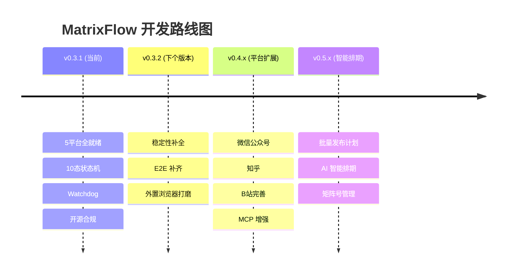

<div align="center">

# MatrixFlow

**AI Native 多平台矩阵式内容分发系统**

[](https://opensource.org/licenses/MIT)
[](https://www.electronjs.org/)
[](https://vuejs.org/)
[](https://www.typescriptlang.org/)
[](CONTRIBUTING.md)
[](CHANGELOG.md)

一键管理抖音 · 小红书 · 视频号 · 快手 · B站五大平台的内容发布、数据分析与智能运营。

[功能特性](#-功能特性) · [项目进度](#-项目进度) · [快速开始](#-快速开始) · [架构设计](#-架构设计) · [参与贡献](#-参与贡献)

</div>

---

## ✨ 为什么选择 MatrixFlow

内容创作者和运营团队每天在不同平台之间反复操作——登录、上传、填写标题、设置标签、选择发布时间。MatrixFlow 把这些流程**自动化、智能化、一体化**。

| 传统方式 | MatrixFlow |
|---------|-----------|
| 逐个平台手动发布 | 五平台一键矩阵分发 |
| 靠经验猜最佳发布时间 | AI 分析历史数据推荐最优时间 |
| 手动检查各平台数据 | 统一数据中心 + 趋势分析 |
| Cookie 过期反复登录 | Cookie 加密持久化 + 状态监控 |
| 群控工具容易被风控 | Patchright stealth + 指纹管理 |

## 🚀 功能特性

### 📡 多平台矩阵分发

支持**抖音、小红书、视频号、快手**四大主流平台，统一管理，一键分发。

- **智能调度** — 根据平台限流策略自动排队，避免触发风控
- **定时发布** — 可视化日历视图，冲突检测，支持平台原生定时
- **分组管理** — 按账号分组配置发布规则（激进/稳健/保守三档模板）
- **批量操作** — 批量创建、复制、定时，支持草稿管理

### 🤖 AI Native

AI 不是插件，是核心引擎。贯穿发布全流程的智能辅助。

- **发布前检查** — AI 审核标题、描述、标签，给出优化建议和质量评分
- **最佳时间推荐** — 基于历史数据分析各平台最佳发布时间窗口
- **规则优化** — AI 根据账号表现自动调整发布策略
- **异常检测** — 实时监控数据异常，主动告警
- **运营周报** — AI 自动生成周度运营分析报告

### 📊 数据中心

多维度数据聚合，一目了然。

- **数据概览** — 全平台发布量、成功率、互动数据聚合展示
- **平台对比** — 横向对比各平台表现差异
- **趋势分析** — 发布量、播放量、互动指标时间趋势
- **监控告警** — 自定义监控计划，数据异常实时推送

### 🔐 安全与隐私

数据安全是底线，不是可选项。

- **Cookie 加密** — AES-256-GCM 加密存储，密钥从主密码派生
- **账号隔离** — 每个账号独立浏览器上下文，Cookie 互不泄露
- **指纹管理** — 浏览器指纹模板库，反检测配置
- **代理池** — HTTP/SOCKS5 代理管理，按账号绑定
- **签名验证** — 远程选择器 Ed25519 签名验证，防供应链攻击
- **沙箱模式** — 渲染进程 sandbox 启用，IPC 白名单保护

### 🛠 MCP Server

内置 [Model Context Protocol](https://modelcontextprotocol.io/) Server，支持 AI Agent 集成。

提供 18 个标准化 Tool，可被 Claude、GPT 等主流 AI Agent 直接调用：

```json
{
  "tools": ["account_list", "publish_create", "stats_overview", ...],
  "transport": "stdio"
}
```

### 📦 更多功能

- **引导向导** — 首次使用 Onboarding 流程
- **数据管理** — 备份/恢复/清理，支持数据导出导入
- **多开面板** — 多账号并行操作
- **自动更新** — 应用内一键更新
- **错误监控** — Sentry 集成，实时错误追踪

## 🏃 快速开始

### 环境要求

- **Node.js** 18+
- **npm** 9+
- **Google Chrome**（Patchright 需要）

### 安装

```bash
git clone https://github.com/your-username/MatrixFlow.git
cd MatrixFlow
npm install
npx patchright install chrome
```

### 开发

```bash
npm run dev          # 启动开发模式（Vite HMR + Electron）
npm run build        # 完整构建
npm test             # 单元 + 集成测试
npm run typecheck    # TypeScript 类型检查
```

### macOS / Windows 一键启动

从 GitHub 克隆或拉取完整仓库后，直接双击项目根目录的：

```text
macOS:   start-macos.command
Windows: start-windows.bat
```

启动器会依次检查 Node.js 18+、npm、Python 3、FFmpeg、项目依赖、
Patchright Chrome 与剪映自动导出 Python 库。已安装且版本未变化的项目会自动跳过，
缺失项目会通过 Homebrew（macOS）、winget（Windows）、npm 或 pip 安装，全部通过后
自动执行生产构建并启动 MatrixFlow 桌面程序。

如果 Windows 没有 `winget`，请先从 Microsoft Store 安装“应用安装程序”。
macOS 首次运行时可能需要在“系统设置 → 隐私与安全性”中允许终端和 MatrixFlow 的
辅助功能权限，以便自动控制剪映导出。

首次换机不会同步账号 Cookie、本地数据库和素材绝对路径，需要在新电脑上重新登录账号、
导入剪映模板，并在 Excel 中填写 Windows 绝对路径。

### 打包

```bash
npm run pack:mac     # macOS
npm run pack:win     # Windows
```

## 🏗 架构设计

```
┌─────────────────────────────────────────┐
│           渲染进程 (Vue 3)                │
│  Views · Components · Pinia Stores      │
│  Element Plus · ECharts · vue-echarts   │
└──────────────────┬──────────────────────┘
                   │ IPC (contextBridge + 白名单)
┌──────────────────┴──────────────────────┐
│           预加载层 (preload.ts)           │
│  API 暴露 · 通道白名单 · 数据序列化       │
└──────────────────┬──────────────────────┘
                   │
┌──────────────────┴──────────────────────┐
│              主进程 (Electron)            │
│                                         │
│  ┌─────────┐ ┌──────────┐ ┌──────────┐ │
│  │Services │ │ Platform  │ │    AI    │ │
│  │Account  │ │ Douyin    │ │ LLM Multi│ │
│  │Publish  │ │ XHS       │ │ Anomaly  │ │
│  │Stats    │ │ Channels  │ │ Cache    │ │
│  │Monitor  │ │ Kuaishou  │ │ Rules    │ │
│  │Comment  │ │           │ │          │ │
│  └─────────┘ └──────────┘ └──────────┘ │
│                                         │
│  ┌─────────────────────────────────────┐ │
│  │           Core Infrastructure       │ │
│  │ BrowserPool · TaskScheduler         │ │
│  │ EventBus · RateLimiter · Logger     │ │
│  │ SignatureVerifier · SentryInit      │ │
│  │ NotificationService · CryptoService │ │
│  └─────────────────────────────────────┘ │
│                                         │
│  ┌──────────┐ ┌────────────────────────┐ │
│  │ SQLite   │ │ Patchright (Stealth)   │ │
│  │ WAL Mode │ │ Worker Threads         │ │
│  │ 22 Tables│ │ Browser Automation     │ │
│  └──────────┘ └────────────────────────┘ │
└─────────────────────────────────────────┘
```

## 🛠 技术栈

| 层 | 技术 |
|---|------|
| **桌面框架** | Electron 41 |
| **前端** | Vue 3 + TypeScript + Pinia + Element Plus |
| **可视化** | ECharts + vue-echarts |
| **数据库** | SQLite + better-sqlite3 (WAL 模式, 22 张表) |
| **浏览器自动化** | Patchright (Playwright Stealth 分支) |
| **AI / LLM** | OpenAI · DeepSeek · Qwen · Anthropic (多提供商) |
| **错误监控** | Sentry (@sentry/electron) |
| **安全** | AES-256-GCM · RSA-2048 · Ed25519 |
| **Agent 集成** | MCP Server (Model Context Protocol) |
| **测试** | Vitest (单元 + 集成) · Patchright (E2E) |

## 📁 项目结构

```
MatrixFlow/
├── electron/                  # 主进程
│   ├── main.ts               # Electron 入口
│   ├── preload.ts            # IPC 白名单
│   ├── core/                 # 基础设施 (BrowserPool, TaskScheduler, EventBus...)
│   ├── services/             # 业务服务 (Account, Publish, Stats, Monitor...)
│   ├── platform/             # 平台适配器 (douyin/xhs/channels/kuaishou)
│   ├── ai/                   # AI 服务 (LLM Multi-Provider, Anomaly, Cache)
│   ├── data/                 # SQLite 数据库 + 迁移
│   ├── config/               # 配置 (限流, AI, Ed25519 公钥)
│   └── ipc/                  # IPC 处理器 (146 个通道)
├── src/renderer/             # 渲染进程 (Vue 3)
│   ├── views/                # 页面组件 (12 个视图)
│   ├── components/           # UI 组件 (10 个组件域)
│   ├── stores/               # Pinia 状态管理 (12 个 Store)
│   └── router/               # 路由配置
├── mcp-server/               # MCP Server (独立 npm 包, 18 个 Tool)
├── tests/                    # 测试
│   ├── unit/                 # 单元测试 (114 文件)
│   └── integration/          # 集成测试
└── docs/                     # 文档 (API, 安全审计, 架构)
```

## 📈 项目进度

### 当前版本 v0.3.1（2026-06-08）

MatrixFlow 处于**早期可用阶段** — 核心发布流程已跑通，正在向生产级稳定性迈进。以下是主要模块的完成度一览：

| 模块 | 进度 | 说明 |
|------|:----:|------|
| 🎯 平台适配 | **5/5** | 抖音 / 小红书 / 视频号 / 快手 / B站 publish + login 全部跑通 |
| 🧠 AI 引擎 | **80%** | 发布前检查、最佳时间推荐、异常检测、运营周报已可用 |
| 🔄 任务调度 | **90%** | 10 态状态机 + Watchdog 复活 + FailureCoordinator 指数退避 |
| 📊 数据中心 | **70%** | 全平台数据概览、对比、趋势分析已可用，竞品监控待开发 |
| 🛡️ 安全体系 | **85%** | Ed25519 签名验证 + AES-256-GCM Cookie 加密 + 沙箱模式 |
| 🧪 测试覆盖 | **75%** | 114 单元测试 + 7 E2E（快手 + B站 E2E 待补齐） |
| 📦 打包分发 | **100%** | macOS (DMG/ZIP) + Windows (NSIS/Portable) |

### 🗺 路线图

我们正在寻找贡献者一起推进以下方向：



> 如果 Mermaid 图无法显示，看下方文字版。

| 版本 | 主题 | 预计 | 状态 | 🙋 需要帮助 |
|------|------|------|------|-------------|
| **v0.3.2** | 稳定性补全 | 1 周 | 📋 规划中 | E2E 测试、config.yaml 迁移 |
| **v0.4.x** | 平台扩展 + MCP | 3-4 周 | 📋 规划中 | 微信/知乎适配器、MCP Tool 扩展 |
| **v0.5.x** | 智能排期 | 4-6 周 | 💡 探索中 | 排期算法、矩阵策略引擎 |

#### v0.3.2 — 下个版本（Help Wanted 🙋）

适合新贡献者的入门任务：

- [ ] 🔧 快手 + B站 E2E 测试补齐 — **Good First Issue**
- [ ] 🔧 状态机迁移回归测试（8 个 test case 骨架已就绪）
- [ ] 🔧 config.yaml 完整化（选择器 TS 迁移到 YAML）
- [ ] 🔧 废弃目录清理 + 外置 Chrome 路径打磨

#### v0.4.x — 平台扩展

- [ ] 🆕 微信公众平台适配（长文 + 图文发布）
- [ ] 🆕 知乎适配（问答 + 专栏）
- [ ] 🆕 B站完善（分区选择、双封面、分片上传、六维统计）
- [ ] 🆕 MCP Tool 扩展（互动评论 + 数据查询 + 调度控制）

#### v0.5.x — 智能排期

- [ ] 🆕 PublishPlan 批量发布（多平台 × 多账号矩阵计划）
- [ ] 🆕 AI 智能排期（基于历史数据 + 平台策略自动推荐）
- [ ] 🆕 矩阵号管理（跨账号内容策略 + 分组规则引擎）

---

## 🤝 参与贡献

MatrixFlow 是一个**社区驱动的开源项目**。无论你是修复一个 Bug、添加一个新平台适配器、还是改进文档，我们都欢迎！

### 快速上手

```bash
git clone https://github.com/your-username/MatrixFlow.git
cd MatrixFlow
npm install
npx patchright install chrome
npm run dev
```

### 适合新贡献者的任务

| 难度 | 任务 | 涉及模块 |
|------|------|----------|
| 🟢 入门 | 补充测试用例 | `tests/unit/` |
| 🟢 入门 | 改进文档和注释 | `docs/`, README |
| 🟡 中等 | 修复 Good First Issue | 见 [Issues](https://github.com/your-username/MatrixFlow/issues) |
| 🟡 中等 | 添加新平台的 config.yaml | `electron/platform/{platform}/` |
| 🔴 进阶 | 实现新平台适配器 | `electron/platform/` 全套 |
| 🔴 进阶 | MCP Tool 扩展 | `mcp-server/` |

### 开发规范

在提交 PR 之前，请阅读 [CONTRIBUTING.md](CONTRIBUTING.md)：

- **Commit**: 遵循 [Conventional Commits](https://www.conventionalcommits.org/)（`feat:` / `fix:` / `docs:` / `test:`）
- **TypeScript**: 严格模式，禁止 `as any` / `@ts-ignore`
- **Vue 3**: `<script setup lang="ts">` + Composition API
- **IPC 通道**: `{domain}:{action}` 命名，preload.ts 白名单必注册
- **测试**: 覆盖率 statements/functions/lines ≥ 70%，branches ≥ 60%
- **平台适配器**: 必须在 `electron/preload.ts` 和 `electron/ipc/handlers.ts` 两处注册新通道

### 添加新平台适配器

想支持一个新平台？参考 [CONTRIBUTING.md](CONTRIBUTING.md) 中的完整流程：

1. `electron/platform/{platform}/` 下创建 publish.ts / login.ts / cookie.ts / selectors.ts / config.yaml
2. 在 `electron/platform/adapter.ts` 注册
3. 在 `electron/services/PublishService.ts` 接入发布流程
4. 编写单元测试 + E2E 测试

---

## 📄 License

[MIT License](LICENSE) © 2024-2026 MatrixFlow Contributors

---

<div align="center">

**如果这个项目对你有帮助，请给个 ⭐ Star 支持一下！**

<sub>Made with ❤️ by the MatrixFlow community</sub>

</div>
